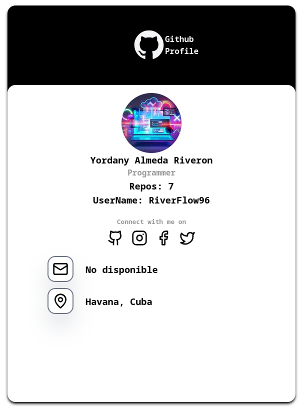

# Digital Presentation



> Pequeña aplicación en React + TypeScript que muestra información pública de un perfil de GitHub en formato tarjeta.

## Tecnologías principales

<p align="left">
	<a href="https://skillicons.dev">
		
	</a>
</p>

- **React** — Biblioteca para construir la interfaz de usuario.
- **TypeScript** — Tipado estático para mayor seguridad y autocompletado.
- **Vite** — Herramienta de construcción y servidor de desarrollo rápido.
- **Redux Toolkit** — Simplifica la configuración de Redux (slices, store, etc.).
- **React Redux** — Conecta React con Redux.
- **Tailwind CSS** — Framework CSS para estilos rápidos y responsivos.
- **lucide-react** — Biblioteca de iconos moderna.

## Estructura principal

- `src/App.tsx` — Componente principal que monta la tarjeta y pasa la prop `user`.
- `src/main.tsx` — Punto de entrada; envuelve la app con `Provider` (Redux).
- `src/Components/Image/Image.tsx` — Obtiene `avatar_url` desde GitHub y guarda la URL en `imageSlice`.
- `src/Components/Information/Information.tsx` — Obtiene `name`, `mail`, `location` y repositorios; actualiza `informationSlice`.
- `src/features/imageSlice_1.ts` — Slice para la URL del avatar.
- `src/features/informationSlice_1.ts` — Slice para `name`, `mail`, `location`, `numberOfProjects`.
- `src/app/store.ts` — Configuración del store y tipos `RootState` / `AppDispatch`.

## Qué incluye

- Peticiones a la API pública de GitHub (`/users/:username`, `/users/:username/repos`).
- Muestra avatar y datos del perfil (nombre, número de repositorios, email, ubicación) en una tarjeta.
- Manejo de valores nulos (`email` / `location`) con fallbacks y renderizado condicional en la UI.
- Buenas prácticas con Redux Toolkit (slices, acciones y reducers).

## Cómo ejecutar

Instala dependencias y arranca el servidor de desarrollo:

```bash
npm install
npm run dev
# o con bun
bun install
bun run dev
```

Abre `http://localhost:5173` (por defecto) y verás la tarjeta con la información del usuario configurado.

## Notas importantes

- La API de GitHub devuelve `email` y `location` como `null` si el usuario los oculta en su perfil público. En esos casos la UI muestra `No disponible`.
- Para cambiar el usuario mostrado edita la prop `user` en `src/App.tsx` (ej.: `user={'RiverFlow96'}`).
- Si deseas más robustez, considera:
  - añadir estados de carga y error en los componentes,
  - limpiar valores del store al desmontar o al cambiar `user`,
  - añadir tests unitarios para los slices.

## Contribuir

Pull requests y issues son bienvenidos. Puedes proponer mejoras como:

- tests, placeholders visuales, o handling de casos extremos.
- documentación adicional (`CONTRIBUTING.md`).

---

Si quieres, puedo también: añadir secciones de pruebas, un archivo `CONTRIBUTING.md`, o generar un commit con este README actualizado.
